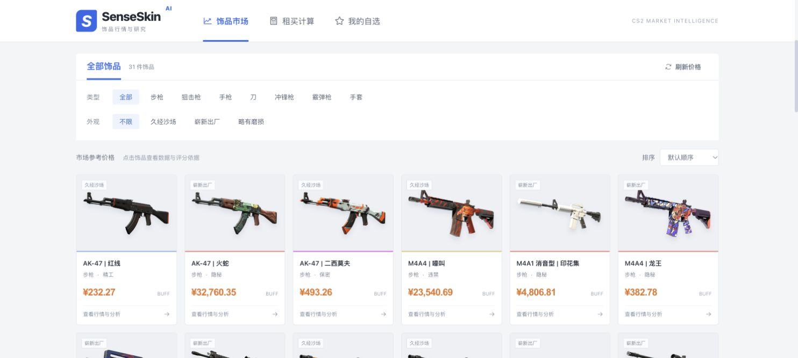

# SenseSkin AI

**CS2 皮肤市场智能决策系统**

A market intelligence and decision-support system for CS2 skin trading. The core value is not chat — it's **identifying opportunities, explaining risks, and supporting buy/hold/avoid decisions** using a structured pipeline over stored prices, curated events, and a small knowledge base. The local demo includes seeded histories and estimated prices; it is not an independently verified live trading feed.

---

## What This Is

SenseSkin is built around one principle: **AI as a system component, not the whole product.**

The system scores available items across 7 independent dimensions, maps active market events to per-item relevance, runs a transparent decision engine, and surfaces the results as actionable intelligence — not just chat responses.

```
Market Events  ──────────────────────┐
Price History  → 7-Dim Scoring   → Decision Engine → BUY / WATCH / HOLD / AVOID
Item Attributes → Event Mapper   → Evidence Chain  → Explainable Rationale
Knowledge Base → Hybrid Retrieval → RAG Layer      → Grounded AI Answers
```

---

## Core Features

### 1. Opportunity Scanner
Scans every item with full event context and surfaces investment opportunities ranked by the decision engine. Each card shows:
- Decision signal: **BUY / WATCH / HOLD / AVOID**
- Rule signal strength (0–100%; not a calibrated probability)
- Driving rationale from the evidence chain
- Active market event (if one is influencing the score)

### 2. 7-Dimensional Scoring Engine
Every item is scored across 7 independently computed dimensions:

| Dimension | Weight | Signal |
|-----------|--------|--------|
| Rarity | 18% | Scarcity and collector demand |
| Exterior | 12% | Float / condition quality |
| Liquidity | 18% | Market depth and tradability |
| Trend | 14% | 7-day price momentum |
| Valuation | 14% | Current price vs 30-day average |
| Demand | 12% | Weapon category × rarity × StatTrak |
| Event Signal | 12% | Active market event impact |

Scores are transparent — every subscores is shown in the UI and traced to its input data.

### 3. Decision Engine
An evidence-accumulation engine that turns scoring signals into a single recommendation with a full audit trail.

**Evidence sources (max contribution):**
- Valuation (low vs 30d avg): ±2.0 pts
- 7-day trend momentum: ±1.5 pts
- Active event impact: ±2.0 pts
- Liquidity: ±1.0 pt
- Overall score tier: ±2.0 pts
- Risk label penalties: −0.5 each

**Decision thresholds:**
```
net ≥ +3.0  AND  total ≥ 62  →  BUY
net ≥ +1.0  AND  total ≥ 52  →  WATCH
net ≥ -1.0  AND  total ≥ 42  →  HOLD
else                          →  AVOID
```

Every recommendation is reproducible by inspecting the `supporting_signals` array.

### 4. Event-Driven Signal Pipeline
Market events (tournaments, patches, seasonal events) are modeled as structured signals and mapped to each item with a relevance score:

```
relevance = category_match × recency_weight × impact_strength × confidence
```

**Category matching:** specific item name (1.0) > weapon type (0.92) > high-tier rarity (0.82) > "all" (0.80) > StatTrak (0.78)

**Recency windows (tournament example):**
- 7–14 days before: 1.00 (prime pre-event window)
- 0–7 days before: 0.90 (imminent speculation)
- 0–7 days after: 0.95 (post-event peak)

The `event_signal` dimension feeds directly into the weighted score, and the decision engine receives the raw `event_impact_score` (−1.0 to +1.0) for its evidence accumulation.

### 5. RAG-Based Market Knowledge (Hybrid Retrieval)
A hybrid retrieval layer over a curated knowledge base (32 entries as of this writing) covering:
- Rarity tiers and pricing dynamics
- Exterior grades and float value impact
- Tournament effects on skin demand
- Platform differences (BUFF vs Steam vs 悠悠有品)
- Rent vs buy decision framework
- StatTrak premium logic

Retrieval combines three independent engines, implemented in `backend/app/rag/`:

| Engine | Library | Role |
|---|---|---|
| FAISS (`IndexFlatIP`, cosine similarity) | `faiss-cpu` + `sentence-transformers` (`paraphrase-multilingual-MiniLM-L12-v2`, 384-dim) | Semantic recall — finds relevant entries even when the query shares no literal words with the document (paraphrases, synonyms) |
| BM25 (`BM25Okapi`) | `rank-bm25` | Keyword / term overlap — a custom mixed CN/EN tokenizer (`app/rag/tokenization.py`) lowercases English tokens and splits Chinese runs into overlapping character bigrams, since whitespace tokenization doesn't work for Chinese |
| TF-IDF (`char_wb`, 2–4 grams) | `scikit-learn` | Exact character-level matching — strong on abbreviations, item names, and precise CN/EN substrings |

The three ranked lists are combined with weighted **Reciprocal Rank Fusion** (`app/rag/fusion.py`), not by summing raw scores directly (their scales aren't comparable — BM25's unbounded term-weight sum vs. two different cosine-similarity ranges):

```
RRF_score(d) = w_faiss / (k + rank_faiss) + w_bm25 / (k + rank_bm25) + w_tfidf / (k + rank_tfidf)
```
with `k = 60` and default weights `FAISS = 0.45, BM25 = 0.35, TF-IDF = 0.20` (`FusionWeights` in `fusion.py`).

**Degrade path**: FAISS is a soft dependency. If the embedding model can't be loaded (no network, no local model cache, `faiss-cpu`/`sentence-transformers` missing) the retriever logs a warning, excludes `faiss` from `active_retrievers`, and automatically renormalizes the BM25/TF-IDF weights to sum to 1 — the `/api/rag/query` endpoint keeps working on BM25 + TF-IDF only, it never raises because of a FAISS failure.

Each result carries `fused_score` (kept as `score` too, for backward compatibility) plus a `retrieval_details` breakdown (`faiss_rank`/`faiss_score`, `bm25_rank`/`bm25_score`, `tfidf_rank`/`tfidf_score`, `active_retrievers`) so the fusion is auditable.

**Evaluation and limitations**: a reproducible 24-query bilingual labeled suite reports Hit@3, Recall@3, MRR@3 and nDCG@3 for TF-IDF, BM25 and lexical RRF. CI checks against the committed baseline; see [evaluation methodology and results](backend/evaluation/README.md). This small author-labeled set is not a held-out benchmark and does not establish production accuracy. The optional semantic mode refuses to report results when embeddings fall back. The 32-entry knowledge base is static and fusion weights remain untuned.

When Claude answers a question (RAG or item chat), its system prompt is grounded with the retrieved context (RAG) or the full decision output, event context, and scoring breakdown (item chat) — not just raw price data. If hybrid retrieval finds nothing for a question, the prompt explicitly tells Claude to say so rather than imply the answer came from the knowledge base.

---

## Architecture

```
backend/
├── app/
│   ├── routers/
│   │   ├── scoring.py          # /score, /decision, /opportunities, /market/events
│   │   ├── chat.py             # Streaming AI chat (grounded in decision context)
│   │   └── rag.py              # RAG query endpoint
│   ├── services/
│   │   ├── scoring.py          # 7-dimensional scoring engine
│   │   ├── decision_engine.py  # BUY/WATCH/HOLD/AVOID with evidence trail
│   │   ├── event_ingestion.py  # Load events.json with 5-min TTL cache
│   │   ├── event_mapper.py     # Per-item relevance scoring
│   │   └── opportunity_detector.py  # Full-pipeline opportunity scan
│   ├── rag/
│   │   ├── retriever.py        # HybridRetriever: orchestrates TF-IDF + BM25 + FAISS, RRF fusion
│   │   ├── tokenization.py     # Mixed CN/EN tokenizer shared by the BM25 engine
│   │   ├── embeddings.py       # sentence-transformers embedder + FAISS IndexFlatIP wrapper
│   │   ├── fusion.py           # Reciprocal Rank Fusion (RRF) + FusionWeights
│   │   └── models.py           # KnowledgeEntry / RetrievalResult / RetrievalDetail dataclasses
│   └── utils/
│       └── metrics.py          # compute_avg, compute_return, compute_volatility, compute_liquidity_score
├── data/
│   ├── events.json             # 22 structured market signals (tournaments, patches, seasonal)
│   └── knowledge.json          # RAG knowledge base (32 articles)
├── tests/                      # pytest suite for the hybrid retriever + RRF + API validation
└── seed/
    └── seed_data.py            # 31 real items with BUFF market prices
```

```
frontend/src/
├── pages/
│   ├── Home.jsx          # Market intelligence dashboard
│   └── ItemDetail.jsx    # Decision-support view per item
├── components/
│   ├── DecisionPanel.jsx    # BUY/WATCH/HOLD/AVOID + evidence chain + 7-dim scores
│   ├── OpportunityPanel.jsx # Event-aware opportunity cards with decision badges
│   └── TrendChart.jsx       # Price history visualization
└── services/
    └── api.js               # All API calls including getItemDecision, getMarketEvents
```

---

## API Reference

| Endpoint | Description |
|----------|-------------|
| `GET /api/items/{id}/decision` | Full pipeline: events → scoring → decision engine |
| `GET /api/items/{id}/score` | 7-dim score breakdown only |
| `GET /api/opportunities?limit=8` | Top opportunities with decision signals |
| `GET /api/market/events` | Active market events with timing labels |
| `GET /api/market-summary` | Market mood, buy signals, avg score |
| `POST /api/items/{id}/chat` | Streaming AI chat grounded in decision context |
| `POST /api/rag/search` | Key-free JSON evidence search with source passages and retrieval diagnostics |
| `POST /api/rag/query` | RAG query over knowledge base (hybrid FAISS+BM25+TF-IDF retrieval) |

---

## Research workspace



[Mobile screenshot](docs/screenshots/mobile.jpg)


- A responsive marketplace with light surfaces, Steam-hosted item artwork, weapon/exterior filters, price sorting, accessible navigation, and consistent detail pages.
- Persistent browser-local watchlists: add/remove items from detail pages and revisit saved items with refreshed backend quotes.
- **Local research briefs** combine loaded platform prices, rule scores, positive/negative evidence and follow-up checks. Export a plain-text brief without an external AI call. Missing data stays explicitly missing.
- Ask Sense exposes expandable source passages before generated text. **Find sources** works without an API key; **Synthesize** falls back to source reading when no key is configured.
- A failed generation keeps its evidence visible. Request cancellation and SSE parsing handle fragmented UTF-8, premature disconnects, and stale request completion.
- Dashboard cards no longer present an unrelated approximation as the seven-dimensional backend score. Rule signal strength is explicitly not a probability of returns.
- Routes are lazy-loaded so detail-page charts do not ship with the initial market page.

## Running Locally

```bash
# Lightweight backend: no model weights or API key required
cd backend
python3.12 -m venv .venv
source .venv/bin/activate
pip install -r requirements-core.txt
cp .env.example .env
uvicorn app.main:app --reload --port 8000
```

In another terminal:

```bash
cd frontend
npm ci
npm run dev
```

Open `http://localhost:5173`. Use **初始化示例数据** for the local market demo, or search the knowledge base immediately with **查找来源**. The seed data is synthetic/illustrative, not a live performance record. Steam refresh may estimate other platforms using fixed multipliers.

To enable generated answers, set `CLAUDE_API_KEY` in the backend `.env`. To enable actual semantic retrieval, install `faiss-cpu sentence-transformers` and set `RAG_ENABLE_FAISS=true`; first use can download the embedding model. Knowledge entries contain unverified historical numerical claims and must not be treated as current prices.

```bash
# Standalone evidence API; no generation cost
curl -X POST http://localhost:8000/api/rag/search \
  -H 'Content-Type: application/json' \
  -d '{"question":"如何评估皮肤流动性？","top_k":3}'

# Backend tests and retrieval regression gate, from backend/
pip install -r requirements-dev.txt
python -m pytest tests -q
python -m app.rag.evaluation --output evaluation/ci-results.json --baseline evaluation/results.json

# Frontend stream tests and production build, from frontend/
npm test
npm run build
```

GitHub Actions runs both test suites, the retrieval regression gate, and the production build on pushes and pull requests. It uploads the per-query retrieval report, including misses. Live Claude and real-embedding integration are optional and are not claimed by the offline CI suite.


---

Artwork sources and limitations: [THIRD_PARTY.md](THIRD_PARTY.md).

## Tech Stack

| Layer | Technology |
|-------|-----------|
| Backend | Python 3.12, FastAPI, SQLAlchemy, SQLite |
| AI | Claude claude-opus-4-6 (Anthropic SDK, streaming) |
| Retrieval | Hybrid: FAISS (`faiss-cpu` + `sentence-transformers`, semantic) + BM25 (`rank-bm25`, keyword) + scikit-learn TF-IDF (char_wb n-grams, exact CN/EN substrings), fused with weighted RRF |
| Frontend | React 18, Vite 5, Tailwind CSS |
| Scoring | Pure Python — deterministic, no LLM in scoring loop |

**The scoring and decision engines are fully deterministic.** No LLM is involved in computing scores or recommendations — Claude is only used for generating natural-language explanations after the structured analysis is complete.

---

## Design Principles

- **Structured signals first.** Every recommendation traces back to numeric evidence, not an opaque LLM answer.
- **Events drive scoring.** A static score without market context is incomplete. Event signal is a first-class scoring dimension.
- **Explainability by default.** The `supporting_signals` array in every decision response is a complete audit trail — every point is attributed to a specific signal with a direction and magnitude.
- **AI as synthesis layer.** Claude receives structured decision output as grounded context. It explains and elaborates; it does not compute.
- **Performance-conscious.** Events load once per scan with a 5-minute TTL cache. `map_events_to_item` is pure Python with no I/O.
